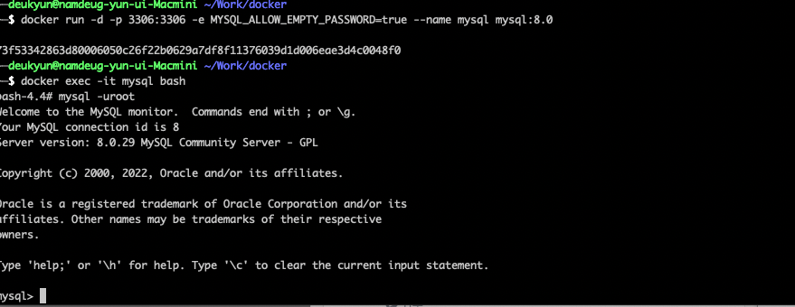
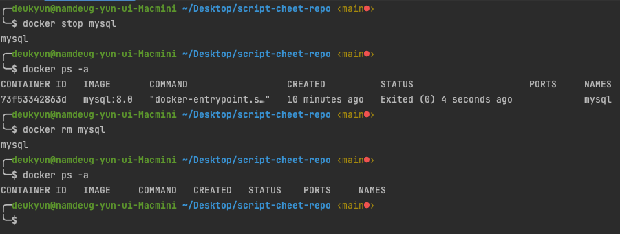

## 컨테이너 실행

```
docker run [OPTIONS] IMAGES[:TAG|@DIGEST][COMMAND][ARGS...]
```

|  옵션   | 설명                                |
|:-----:|-----------------------------------|
|  -d   | detached mode (백그라운드 모드 실행)       |
|  -p   | 포트 포워딩                            |
|  -v   | 마운트 지정                            |
|  -e   | 환경 변수 설정                          |
| -name | 컨테이너 이름 설정                        |
|  -rm  | 프로세스 종료시 컨테이너 자동 제거               |
|  -it  | -i, -t 를 동시에 사용한 것, 터미널 입력을 위해 사용 |
| -link | 컨테이너 연결                           |


예시
MYSQL 실행 후 bash 터미널 진입
```
docker run -d -p 3306:3306 -e MYSQL_ALLOW_EMPTY_PASSWORD=true --name mysql mysql:8.0
docker exec -it mysql bash
```



mysql 컨테이너 중지 후 제거 
```text
docker ps -a
docker rm mysql
```

---
rabbitmq

```
docker run -d --name rabbitmq --network ecommerce-network \
 -p 15672:15672 -p 5672:5672 -p 15671:15671 -p 5671:5671 -p 4369:4369 \
 -e RABBITMQ_DEFAULT_USER=guest \
 -e RABBITMQ_DEFAULT_PASS=guest rabbitmq:management
 ```

