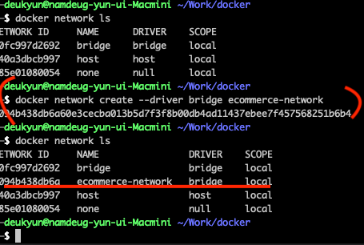

## network 생성
```
docker network ls
docker network create --driver bridge [브릿지 이름]
docker network create --gateway 172.18.0.1 --subnet 172.18.0.0/16 ecommerce-network
```



### Host network
- 네트워크를 호스트로 설정하면 호스트의 네트워크 환경을 그대로 사용
- 포트 포워딩 없이 내부 어플리케이션 사용

### None network
- 네트워크를 사용하지 않음
- IO 네트워크만 사용, 외부와 단절


## docker network inspect
```
╭─deukyun@namdeug-yun-ui-Macmini ~/Work/docker
╰─$ docker network inspect ecommerce-network
```

```json
[
    {
        "Name": "ecommerce-network",
        "Id": "70b2e678bc4b364970acb14cd824dbca2551cfed513b3858b5ec4f67f6a348c8",
        "Created": "2022-09-29T05:55:33.014588968Z",
        "Scope": "local",
        "Driver": "bridge",
        "EnableIPv6": false,
        "IPAM": {
            "Driver": "default",
            "Options": {},
            "Config": [
                {
                    "Subnet": "172.18.0.0/16",
                    "Gateway": "172.18.0.1"
                }
            ]
        },
        "Internal": false,
        "Attachable": false,
        "Ingress": false,
        "ConfigFrom": {
            "Network": ""
        },
        "ConfigOnly": false,
        "Containers": {},
        "Options": {},
        "Labels": {}
    }
]
```